# AxioVital Native — Current Architecture Document

> **Audit Date:** 2026-09-10
> **Source of Truth:** The `native/` repository at commit HEAD
> **Scope:** Current-state architecture only — no future-state proposals

---

## 1. Executive Overview

AxioVital Native is a **healthcare desktop platform** consisting of two primary subsystems within a single .NET 9 solution:

1. **AxioVital Desktop** — A Windows desktop application built with **WinUI 3** (Windows App SDK) targeting clinical workflows: patient management, document management, clinical messaging, analytics, scheduling, care pathways, and lab views.
2. **AxioVital API** — An **ASP.NET Core 9 REST API** providing backend services for document management, health checks, authentication infrastructure (JWT/Argon2id), and multi-tenant data isolation via PostgreSQL.

Both subsystems are packaged in a single Visual Studio solution (`AxioVital.sln`) with shared contracts and are designed to run together — the Desktop application communicates with the API over HTTP.

### Application Type

| Attribute              | Value                                                     |
|------------------------|-----------------------------------------------------------|
| **Primary Type**       | Windows Desktop Healthcare Application + REST API Backend |
| **Platform**           | Windows 10/11 (x64, x86, ARM64)                          |
| **Framework**          | .NET 9, WinUI 3, ASP.NET Core 9                          |
| **Architecture Style** | Clean Architecture (Domain → Application → Infrastructure → API) with MVVM Desktop |
| **Database**           | PostgreSQL 16                                             |
| **Object Storage**     | MinIO (S3-compatible)                                     |
| **Caching**            | Redis 7                                                   |
| **Messaging**          | Redpanda/Kafka (stub only)                                |
| **Deployment**         | Self-contained `.exe` with custom installer               |

### Implementation Status Summary

| Status                 | Meaning                                                   |
|------------------------|-----------------------------------------------------------|
| **Implemented**        | Verified in source code and/or configuration              |
| **Partially Implemented** | Some implementation exists but is incomplete           |
| **Referenced / Planned** | Mentioned in interfaces, config, comments, or docs but not implemented |
| **Not Identified**     | No reliable implementation evidence found                 |

---

## 2. Current System Architecture

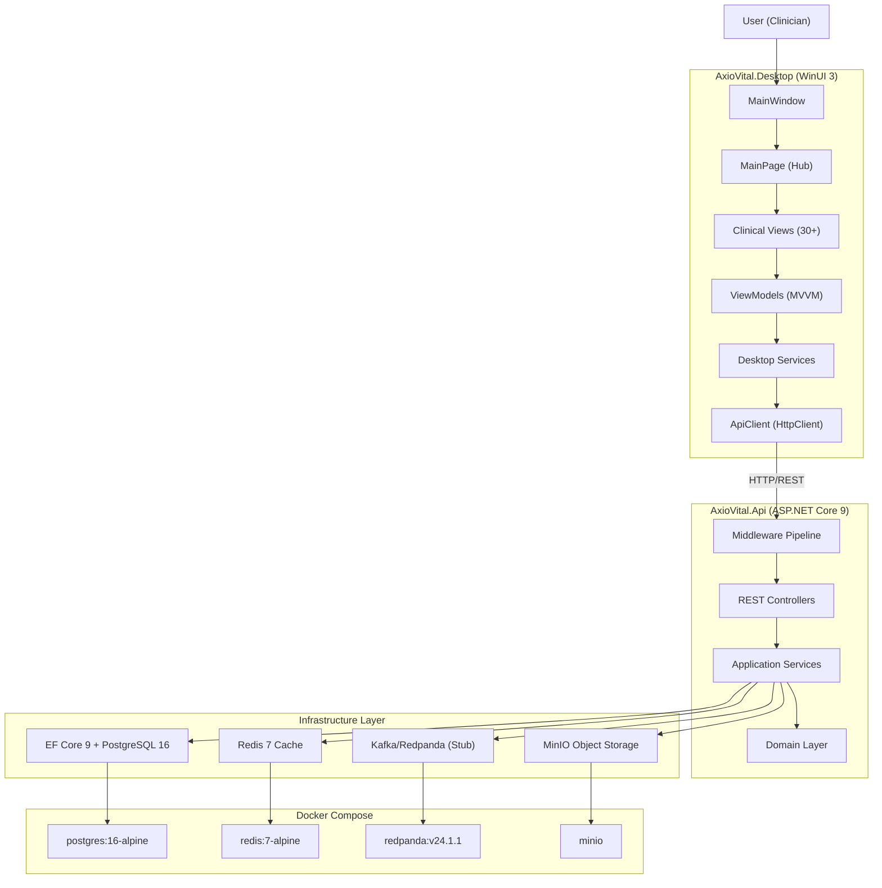

---

## 3. AxioVital Native Position Within the Larger AxioVital System

Based on repository evidence, the following external system relationships were evaluated:

| External System              | Status                     | Evidence                                                              |
|------------------------------|----------------------------|-----------------------------------------------------------------------|
| AxioVital Backend API        | **Implemented**            | Desktop → API via `HttpClient` to `api/v1/auth/login`, `api/documents` |
| PostgreSQL Database          | **Implemented**            | EF Core `AxioVitalDbContext`, Docker Compose, connection strings      |
| MinIO Object Storage         | **Implemented**            | `MinioStorageService`, Docker Compose, `IObjectStorageService`        |
| Redis Cache                  | **Implemented**            | `RedisCacheService`, Docker Compose, `StackExchange.Redis`            |
| Redpanda (Kafka)             | **Partially Implemented**  | Docker Compose runs Redpanda; code has stub publisher/consumer (log-only, no actual Kafka client) |
| FHIR R4                      | **Referenced / Planned**   | `IFhirService` interface + `FhirSettings` config section; no implementation class |
| HL7 v2.x                     | **Referenced / Planned**   | `IHl7Service` interface + config section; no implementation class     |
| DICOM                        | **Referenced / Planned**   | `IDicomService` interface + config section; no implementation class   |
| WebAuthn / FIDO2             | **Referenced / Planned**   | `IWebAuthnService` interface; no implementation class, no registration in DI |
| Axio ID                      | **Not Identified**         | No code, entities, services, or configuration referencing Axio ID     |
| Axio Card                    | **Not Identified**         | No NFC, card, or Axio Card code found                                 |
| ABHA / ABDM                  | **Not Identified**         | No ABHA, ABDM, or Ayushman Bharat code or configuration found        |
| Firebase                     | **Not Identified**         | No Firebase SDK, configuration, or references                         |
| Supabase                     | **Not Identified**         | No Supabase references                                                |
| OAuth / Social Login          | **Not Identified**         | No OAuth provider configuration                                      |
| Analytics / Crash Reporting  | **Not Identified**         | No external analytics or crash reporting SDK                          |

---

## 4. Repository / Module Architecture

```
native/
├── AxioVital.sln                          # Visual Studio solution (9 projects)
├── docker-compose.yml                     # Infrastructure: PostgreSQL, Redis, Redpanda, MinIO
├── .env / .env.example                    # Environment variables
├── package.json                           # npm wrapper for dotnet commands + prettier
├── Directory.Build.props                  # Global MSBuild properties
├── Directory.Build.targets                # Global MSBuild targets
├── Directory.Packages.props               # Central NuGet package version management
│
├── axiovital-backend/
│   ├── AxioVital.Domain/                  # Domain layer: entities, enums, interfaces, value objects
│   ├── AxioVital.Contracts/               # Shared DTOs, request/response models
│   ├── AxioVital.Application/             # Application services, interfaces, CQRS stubs
│   ├── AxioVital.Infrastructure/          # EF Core, Redis, MinIO, Kafka, JWT, Argon2
│   └── AxioVital.Api/                     # ASP.NET Core REST API (entry point)
│
├── axiovital-frontend/
│   └── AxioVital.Desktop/                 # WinUI 3 desktop application
│       ├── Views/                         # 30+ XAML views
│       ├── ViewModels/                    # MVVM view models
│       ├── Services/                      # API client, auth, navigation
│       ├── Models/                        # Client-side data models
│       ├── Controls/                      # Custom XAML controls
│       ├── Widgets/                       # Popup widgets (MedicationListPopup)
│       ├── Navigation/                    # Navigation interfaces
│       └── Resources/                     # XAML resource dictionaries
│
├── tests/
│   ├── AxioVital.UnitTests/               # Unit test runner
│   ├── AxioVital.IntegrationTests/        # EF Core integration tests
│   └── AxioVital.ApiTests/                # API endpoint tests
│
├── database/
│   ├── migrations/001_InitialCreate.sql   # SQL schema: tenants, users
│   └── scripts/seed_data.sql              # Seed data
│
├── infrastructure/
│   ├── docker/Dockerfile.api              # Multi-stage API Dockerfile
│   ├── kubernetes/deployment.yaml         # K8s deployment manifest (minimal)
│   ├── nginx/nginx.conf                   # Reverse proxy config (minimal)
│   └── terraform/main.tf                  # Terraform config (minimal)
│
├── axiovital-installer/                   # Self-extracting .exe installer (C# console app)
├── AxioVital-App/                         # Published self-contained desktop build output
├── scripts/build-desktop.ps1              # PowerShell build, publish, and installer script
├── tools/dev-setup.ps1                    # Developer environment setup script
├── docs/                                  # Documentation (architecture, security, database, etc.)
├── security/security-policy.md            # Security policy document
├── interoperability/                      # Specification documents (FHIR, HL7, DICOM)
├── storage/storage-config.json            # Storage configuration reference
├── .github/workflows/                     # CI/CD (GitHub Actions)
└── AxioVital-Setup.exe                    # Built installer binary (~111 MB)
```

### Key Module Details

#### AxioVital.Domain
- **Purpose:** Core domain entities and business rules
- **Key files:** `User.cs`, `Tenant.cs`, `MedicalDocument.cs`, `Role.cs`, `Permission.cs`, `AuditableEntity.cs`, `BaseEntity.cs`
- **Value Objects:** `Email`, `TenantId`, `UserId`
- **Enums:** `FileCategory`, `SystemRole`, `PermissionType`
- **Interfaces:** `IRepository<T>`, `ITenantProvider`, `IUnitOfWork`
- **Dependencies:** None (innermost layer)

#### AxioVital.Contracts
- **Purpose:** Shared request/response DTOs between API and Desktop
- **Key files:** `LoginRequest`, `AuthResponse`, `DocumentDto`, `UploadDocumentRequest`, `HealthResponse`, `ApiErrorResponse`
- **Dependencies:** None

#### AxioVital.Application
- **Purpose:** Application-level orchestration, service interfaces
- **Key files:** `DocumentService.cs` (only implemented service), `DependencyInjection.cs`
- **Interfaces:** `IDocumentService`, `IObjectStorageService`, `ICacheService`, `IEventPublisher`, `IPasswordHasher`, `ITokenService`, `IWebAuthnService`
- **CQRS stubs:** `CreateUserCommand.cs`, `GetUserByIdQuery.cs` (minimal, not wired up)
- **Dependencies:** Domain, Contracts

#### AxioVital.Infrastructure
- **Purpose:** External system integrations and data access
- **Submodules:**
  - `Authentication/` — `Argon2PasswordHasher`, `JwtTokenService`, `TenantContext`
  - `Persistence/` — `AxioVitalDbContext` with global query filters for tenant isolation and soft-delete
  - `Repositories/` — Generic `Repository<T>` using EF Core
  - `Caching/` — `RedisCacheService` using StackExchange.Redis
  - `Storage/` — `MinioStorageService` with full CRUD + presigned URLs
  - `Messaging/` — `KafkaEventPublisher`/`KafkaEventConsumer` (stubs: log-only, no actual Kafka client)
  - `Interoperability/` — Interfaces only: `IFhirService`, `IHl7Service`, `IDicomService`
- **Dependencies:** Domain, Application, EF Core, Redis, MinIO SDK, Serilog

#### AxioVital.Api
- **Purpose:** REST API entry point
- **Controllers:** `DocumentsController` (CRUD for medical documents), `HealthController` (health info endpoint)
- **Middleware:** `GlobalExceptionMiddleware`, `CorrelationIdMiddleware`, `TenantResolutionMiddleware`
- **Authentication:** JWT Bearer via `Microsoft.AspNetCore.Authentication.JwtBearer`
- **Authorization:** `PermissionRequirement` class (stub, not wired to handlers)
- **Dependencies:** Application, Infrastructure, Contracts

#### AxioVital.Desktop
- **Purpose:** WinUI 3 desktop client application
- **Entry Point:** `App.xaml.cs` → `MainWindow` → `MainPage`
- **Architecture:** MVVM using CommunityToolkit.Mvvm
- **Dependencies:** Contracts (shared DTOs), WinUI 3 SDK, Serilog, Microsoft.Extensions.*

---

## 5. Application Entry & Bootstrap Architecture

### Backend API Bootstrap

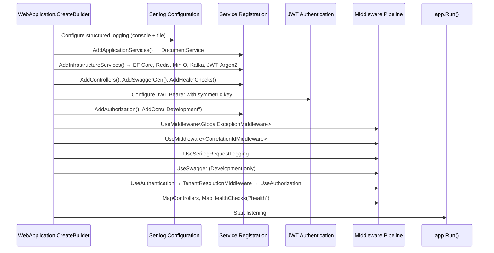

**Source:** [Program.cs](file:///c:/Users/HP/native/axiovital-backend/AxioVital.Api/Program.cs)

### Desktop Application Bootstrap

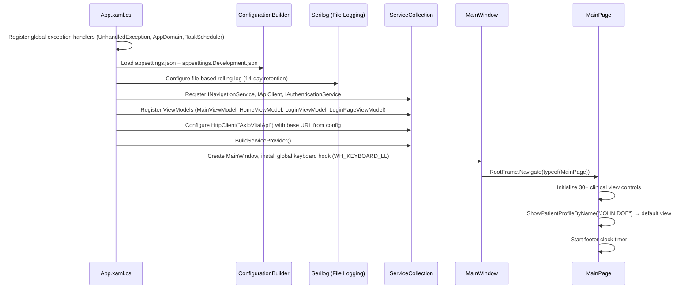

**Source:** [App.xaml.cs](file:///c:/Users/HP/native/axiovital-frontend/AxioVital.Desktop/App.xaml.cs), [MainWindow.xaml.cs](file:///c:/Users/HP/native/axiovital-frontend/AxioVital.Desktop/MainWindow.xaml.cs)

---

## 6. Frontend / UI Architecture

### Framework & Pattern

| Aspect               | Implementation                                    |
|-----------------------|----------------------------------------------------|
| **UI Framework**      | WinUI 3 (Windows App SDK 1.6)                     |
| **Language**          | C# with XAML                                       |
| **Pattern**           | MVVM (CommunityToolkit.Mvvm 8.4.0)                |
| **DI Container**      | Microsoft.Extensions.DependencyInjection           |
| **Logging**           | Serilog → File                                     |
| **API Communication** | HttpClient via `IHttpClientFactory`                |

### View Inventory (30+ Views)

| View                              | Purpose                                    | Size    |
|-----------------------------------|--------------------------------------------|---------|
| `MainPage`                        | Primary hub: sidebar, tabs, overlays       | 137 KB XAML, 104 KB code-behind |
| `PatientProfileView`              | Patient clinical profile                   | 47 KB XAML, 69 KB code-behind   |
| `PatientListView`                 | Patient listing/search                     | 96 KB XAML                       |
| `GrowthChartView`                 | Pediatric growth charts                    | 103 KB XAML                      |
| `PhysicianHandoffView`            | Physician handoff workflow                 | 81 KB XAML                       |
| `UpToDateView`                    | Clinical reference viewer                  | 64 KB XAML                       |
| `MedicationListPopup`             | Patient medication management              | 53 KB XAML                       |
| `NewPatientView`                  | Patient registration form                  | 49 KB XAML                       |
| `NotificationsView`               | Notification center                        | 47 KB XAML                       |
| `QualityMeasuresView`             | Quality metrics dashboard                  | 46 KB XAML                       |
| `FacilityTransferPage`            | Inter-facility transfer                    | 43 KB XAML                       |
| `AnalyticsView`                   | Analytics dashboard                        | 43 KB XAML                       |
| `CarePathwaysView`                | Care pathway management                    | 37 KB XAML                       |
| `DeveloperPanelView`              | Developer tools/diagnostics                | 37 KB XAML                       |
| `FileManagerView`                 | Medical document manager                   | 32 KB XAML                       |
| `SchedulerView`                   | Appointment scheduling                     | 31 KB XAML                       |
| `DischargeListView`               | Discharge management                       | 14 KB XAML                       |
| `HistoriesChartView`              | Clinical history charts                    | 22 KB XAML                       |
| `BedTransferView`                 | Bed transfer management                    | 16 KB XAML                       |
| `ReferralsTransferListView`       | Referrals and transfers                    | 15 KB XAML                       |
| `MessageCenterView`               | Clinical messaging                         | 13 KB XAML                       |
| `CustomisedView`                  | Customizable view                          | 13 KB XAML                       |
| `LoginPage`                       | User authentication screen                 | 8 KB XAML                        |
| `LabsView`                        | Laboratory results viewer                  | 7 KB XAML                        |
| `HomePage`                        | Home/landing page                          | 1 KB XAML                        |
| `OngoingActivitiesView`           | Active activities tracker                  | 8 KB XAML                        |
| `ViewEncounterDialog`             | Encounter detail dialog                    | 11 KB XAML                       |
| `PendingTransferWarningDialog`    | Transfer warning confirmation              | 7 KB XAML                        |

### UI Architecture Diagram

```mermaid
flowchart LR
    subgraph Desktop["AxioVital.Desktop"]
        MainWindow["MainWindow\n(Frame Host + Keyboard Hook)"]
        MainPage["MainPage\n(Hub: Sidebar + TabBar + Content + Overlays)"]

        subgraph ClinicalViews["Clinical Views"]
            PatientProfile["PatientProfileView"]
            PatientList["PatientListView"]
            FileManager["FileManagerView"]
            Labs["LabsView"]
            Analytics["AnalyticsView"]
            CarePathways["CarePathwaysView"]
            Scheduler["SchedulerView"]
            Discharge["DischargeListView"]
            OtherViews["... 20+ more views"]
        end

        subgraph Overlays["Overlay Panels"]
            QuickPanel["Quick Panel (Ctrl+Q)"]
            PatientDetails["Patient Details (F9)"]
            PersonSearch["Person Search (F10)"]
            DevPanel["Developer Panel"]
            MedPopup["Medication Popup"]
        end

        subgraph MVVM["MVVM Layer"]
            VMs["ViewModels"]
            Services["Services Layer"]
            ApiClient["ApiClient"]
        end
    end

    MainWindow --> MainPage
    MainPage --> ClinicalViews
    MainPage --> Overlays
    ClinicalViews --> VMs
    VMs --> Services
    Services --> ApiClient
    ApiClient -->|HTTP| API["AxioVital.Api"]
```

---

## 7. Navigation Architecture

Navigation in AxioVital Desktop is **frame-based with overlay panels**, not a traditional router.

| Mechanism                    | Implementation                                          |
|------------------------------|---------------------------------------------------------|
| **Root Navigation**          | `MainWindow.RootFrame.Navigate(typeof(MainPage))`      |
| **Intra-page Navigation**   | `MainPage` controls visibility of 30+ embedded views via code-behind |
| **Tab Navigation**           | Chrome-style `OpenTabs` (`ObservableCollection<MainTabModel>`) managed in `MainPage.xaml.cs` |
| **Overlay Panels**           | Quick Panel (Ctrl+Q), Patient Details (F9), Person Search (F10), Developer Panel — toggled by keyboard hooks or buttons |
| **Popup Dialogs**            | Bed Transfer, View Encounter, Pending Transfer Warning, Medication Popup |
| **Global Keyboard Hooks**    | `SetWindowsHookEx(WH_KEYBOARD_LL)` for Ctrl+Q, F9, F10, Escape |
| **Login Flow**               | `LoginPage` shown before `MainPage` (via `OnLoginSuccess` callback) |
| **Protected Routes**         | Not identified — no route guard or authentication gate observed before `MainPage` loads |
| **Deep Linking**             | Not identified                                           |

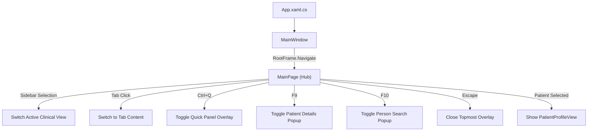

**Source:** [MainWindow.xaml.cs](file:///c:/Users/HP/native/axiovital-frontend/AxioVital.Desktop/MainWindow.xaml.cs), [MainPage.xaml.cs](file:///c:/Users/HP/native/axiovital-frontend/AxioVital.Desktop/Views/MainPage.xaml.cs)

---

## 8. State Management Architecture

| State Type           | Mechanism                                                     | Location                        |
|----------------------|---------------------------------------------------------------|---------------------------------|
| **UI State**         | XAML data binding + code-behind properties                    | Views (`.xaml.cs`)              |
| **ViewModel State**  | `ObservableProperty` via CommunityToolkit.Mvvm                | `ViewModels/`                   |
| **Application State**| Singleton services in DI container                            | `App.Services`                  |
| **Auth State**       | `AuthenticationService.IsAuthenticated`, `CurrentToken`, `CurrentUser` | In-memory singleton    |
| **Tab State**        | `ObservableCollection<MainTabModel>` in `MainPage`            | `MainPage.xaml.cs`              |
| **Server State**     | Not cached client-side; fetched per-request via `ApiClient`   | Via HTTP calls                  |
| **Persistent State** | Not identified — no local database, `AsyncStorage`, or file-based state persistence in Desktop |                       |

The Desktop application currently holds all state in memory. There is no observable local persistence mechanism — closing the application loses all session state.

---

## 9. Networking / API Architecture

### Desktop → API Communication

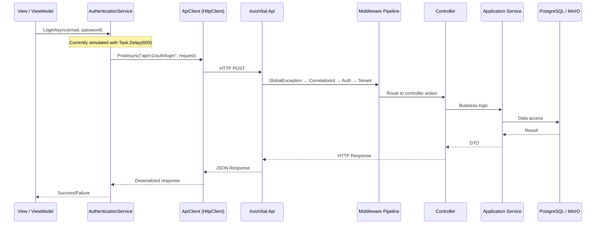

### API Client Implementation

| Aspect               | Implementation                                            |
|-----------------------|-----------------------------------------------------------|
| **HTTP Library**      | `System.Net.Http.HttpClient` via `IHttpClientFactory`     |
| **Base URL**          | Configured in `appsettings.json` → `Api:BaseUrl` (default: `https://localhost:5001`) |
| **Serialization**     | `System.Net.Http.Json` (System.Text.Json)                 |
| **Auth Header**       | Bearer token injected via `SetAuthToken()`                |
| **Error Handling**    | Returns `default` on non-success status codes (no exception, no retry) |
| **Retry/Timeout**     | Not configured                                            |
| **Request Interceptors** | Not implemented                                        |

**Source:** [ApiClient.cs](file:///c:/Users/HP/native/axiovital-frontend/AxioVital.Desktop/Services/ApiClient.cs)

---

## 10. API Inventory

### Implemented API Endpoints

| Endpoint                          | Method   | Purpose                        | Controller          | Auth Required |
|-----------------------------------|----------|--------------------------------|---------------------|---------------|
| `POST /api/documents/upload`      | POST     | Upload medical document        | DocumentsController | No (no `[Authorize]`) |
| `GET /api/documents/{id}/download`| GET      | Download document by ID        | DocumentsController | No            |
| `GET /api/documents/{id}/preview` | GET      | Get presigned preview URL      | DocumentsController | No            |
| `GET /api/documents`              | GET      | List documents with filters    | DocumentsController | No            |
| `DELETE /api/documents/{id}`      | DELETE   | Soft-delete document           | DocumentsController | No            |
| `GET /health/info`                | GET      | Health status + dependency check | HealthController  | No            |
| `GET /health`                     | GET      | ASP.NET Health Checks endpoint | Built-in            | No            |

### Referenced but Not Implemented

| Endpoint                     | Referenced In                    | Status                |
|------------------------------|----------------------------------|-----------------------|
| `POST api/v1/auth/login`    | `AuthenticationService.cs` (Desktop) | **Not Implemented** — no AuthController exists in the API |

**Observation:** The Desktop `AuthenticationService.LoginAsync()` calls `api/v1/auth/login`, but this endpoint does not exist in the API. The login flow in `LoginPageViewModel` uses `Task.Delay(600)` to simulate authentication.

---

## 11. Authentication Architecture

### Backend Authentication Infrastructure

| Component                    | Status                  | Evidence                                           |
|------------------------------|-------------------------|----------------------------------------------------|
| JWT Token Generation         | **Implemented**         | `JwtTokenService.GenerateAccessToken()`            |
| JWT Token Validation         | **Implemented**         | `JwtTokenService.ValidateToken()`, JWT Bearer middleware |
| Refresh Token Generation     | **Implemented**         | `JwtTokenService.GenerateRefreshToken()`           |
| Argon2id Password Hashing    | **Implemented**         | `Argon2PasswordHasher` with 64 MB memory, 3 iterations |
| JWT Bearer Middleware        | **Implemented**         | Configured in `Program.cs`                         |
| Login/Register Controller    | **Not Implemented**     | No `AuthController` or auth endpoints exist        |
| Refresh Token Flow           | **Not Implemented**     | `RefreshTokenRequest` contract exists; no controller/service uses it |
| WebAuthn/FIDO2               | **Referenced / Planned** | `IWebAuthnService` interface only; no implementation |
| Password Reset               | **Not Identified**      |                                                    |
| Session Management           | **Not Identified**      | No server-side session; JWT is stateless           |

### Desktop Authentication

| Component                    | Status                  | Evidence                                           |
|------------------------------|-------------------------|----------------------------------------------------|
| Login UI                     | **Implemented**         | `LoginPage.xaml` with user dropdown, password, domain selector |
| Auth Service                 | **Partially Implemented** | `AuthenticationService.LoginAsync()` calls API but actual login is simulated (`Task.Delay`) |
| Token Storage                | **Not Implemented**     | Token held in memory only (`CurrentToken` property) |
| Secure Storage               | **Not Identified**      | No Windows Credential Manager, DPAPI, or keychain usage |
| Biometric Auth               | **Not Identified**      |                                                    |
| Session Persistence          | **Not Implemented**     | Auth state lost on app restart                     |

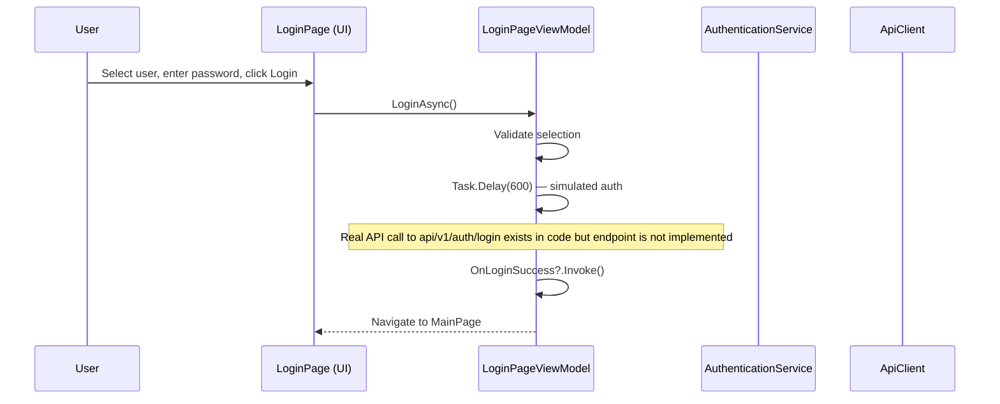

**Source:** [LoginPageViewModel.cs](file:///c:/Users/HP/native/axiovital-frontend/AxioVital.Desktop/ViewModels/LoginPageViewModel.cs), [AuthenticationService.cs](file:///c:/Users/HP/native/axiovital-frontend/AxioVital.Desktop/Services/AuthenticationService.cs)

---

## 12. Axio ID Architecture

**Status: Not Identified in Current Repository**

No code, entities, services, configuration, or references to "Axio ID" were found in the repository. The User entity has standard fields (`Id`, `Email`, `TenantId`) with no Axio ID identifier.

---

## 13. Axio Card Architecture

**Status: Not Identified in Current Repository**

No NFC, QR, card scanning, card provisioning, card pairing, card authentication, or any references to "Axio Card" were found in the repository. There are no NFC or smartcard libraries in the dependency tree.

---

## 14. ABHA Integration Architecture

**Status: Not Identified in Current Repository**

No references to ABHA, ABDM, Ayushman Bharat, Health Information Exchange, Health Information User/Provider, or any Indian healthcare interoperability APIs were found in the repository.

---

## 15. Patient Identity Architecture

### Implemented Identity Model

The system uses a multi-tenant user model. "Patient" exists as a client-side concept in the Desktop application with limited backend representation.

| Identity Concept     | Status                  | Evidence                                           |
|----------------------|-------------------------|----------------------------------------------------|
| User ID (Guid)       | **Implemented**         | `User.Id` (BaseEntity), JWT `sub` claim            |
| Tenant ID (Guid)     | **Implemented**         | `User.TenantId`, `Tenant.Id`, JWT `tenant_id` claim |
| Patient ID (Guid)    | **Partially Implemented** | `MedicalDocument.PatientId` (optional FK), `PatientModel.Id` in Desktop |
| Email                | **Implemented**         | `User.Email` (authentication identifier)           |
| MedicalRecordNumber  | **Desktop Only**        | `PatientModel.MedicalRecordNumber` (client-side model, no backend entity) |
| Axio ID              | **Not Identified**      |                                                    |
| ABHA ID              | **Not Identified**      |                                                    |
| Card ID              | **Not Identified**      |                                                    |

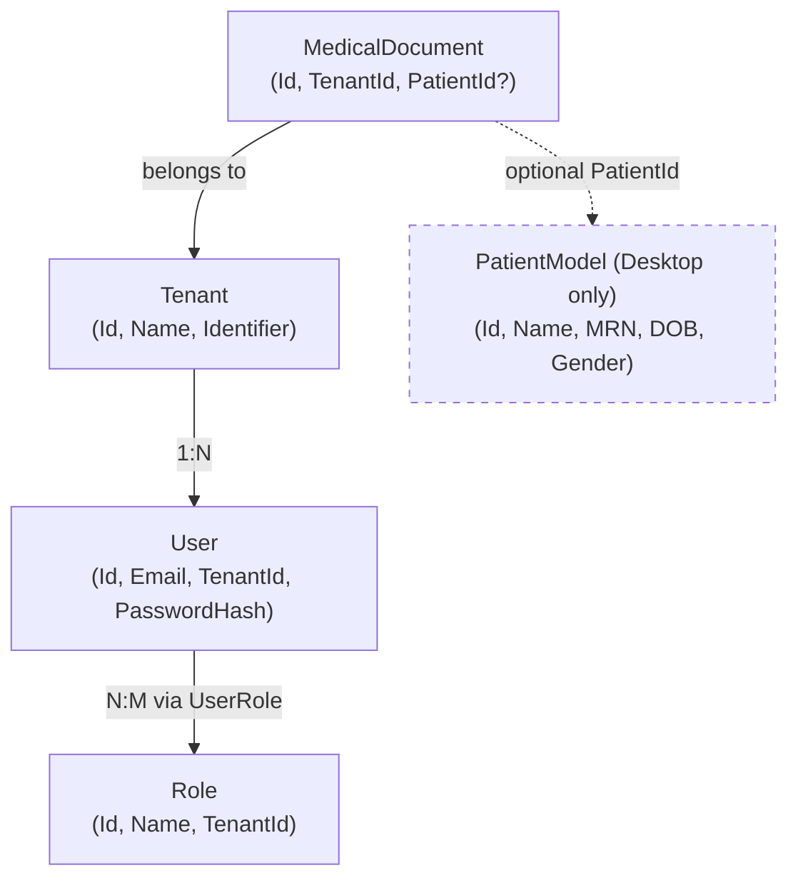

**Observation:** There is no `Patient` entity in the backend domain layer. `PatientModel` exists only in the Desktop project as a UI model. The `MedicalDocument.PatientId` is an optional `Guid?` with no foreign key constraint to a patient table.

---

## 16. Healthcare Data Architecture

| Data Type             | Status                  | Evidence                                           |
|-----------------------|-------------------------|----------------------------------------------------|
| Medical Documents     | **Implemented**         | `MedicalDocument` entity + `DocumentService` + MinIO storage + API endpoints |
| File Categories       | **Implemented**         | `FileCategory` enum: MedicalReport, LabResult, ImagingStudy, Prescription, InsuranceDocument, ConsentForm, Referral, SurgicalNote, Other |
| Patient Profile       | **Desktop UI Only**     | `PatientProfileView` (69 KB code-behind) — hardcoded/mock data, no API integration |
| Lab Results           | **Desktop UI Only**     | `LabsView`, `LabOrderItem` model — no backend API |
| Medications           | **Desktop UI Only**     | `MedicationListPopup` — no backend API             |
| Discharge Records     | **Desktop UI Only**     | `DischargeListView`, `DischargePatientItem` — no backend API |
| Appointments          | **Desktop UI Only**     | `SchedulerView`, `AppointmentModel` — no backend API |
| Referrals             | **Desktop UI Only**     | `ReferralsTransferListView` — no backend API       |
| Quality Measures      | **Desktop UI Only**     | `QualityMeasuresView`, `QualityMeasureRecord` — no backend API |
| Vital Signs           | **Not Identified**      |                                                    |
| Prescriptions (FHIR)  | **Not Identified**      |                                                    |

### Document Data Flow (Only Fully Implemented Flow)

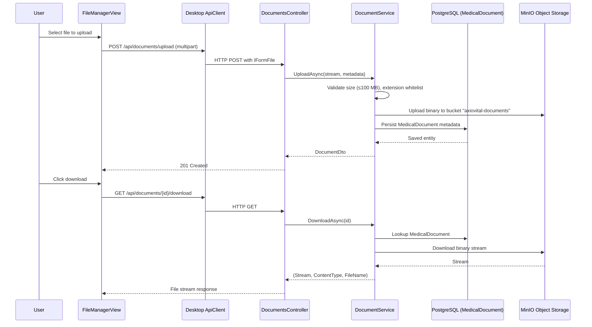

---

## 17. Data Flow Architecture

### Implemented Flows

| Flow                     | Status                  | Evidence                                     |
|--------------------------|-------------------------|----------------------------------------------|
| Application Startup      | **Implemented**         | `App.xaml.cs` → DI → `MainWindow` → `MainPage` |
| Login (Simulated)        | **Partially Implemented** | `LoginPageViewModel` with `Task.Delay`       |
| Document Upload          | **Implemented**         | `DocumentsController.Upload` → `DocumentService` → MinIO + PostgreSQL |
| Document Download        | **Implemented**         | `DocumentsController.Download` → MinIO stream |
| Document List/Search     | **Implemented**         | `DocumentsController.List` with filters      |
| Document Delete          | **Implemented**         | Soft-delete via `IsDeleted` flag              |
| Document Preview         | **Implemented**         | Presigned MinIO URL with 15-min expiry        |
| Health Check             | **Implemented**         | `/health` and `/health/info`                  |
| Patient Profile View     | **Desktop UI Only**     | Hardcoded data in code-behind                 |
| Registration             | **Not Implemented**     |                                                |
| Logout                   | **Partially Implemented** | `AuthenticationService.Logout()` clears in-memory token; no server-side invalidation |
| Profile Update           | **Not Implemented**     |                                                |
| Notifications            | **Not Implemented**     |                                                |
| Offline Mode             | **Not Implemented**     |                                                |
| Synchronization          | **Not Implemented**     |                                                |

---

## 18. Local Storage Architecture

### Desktop Application

| Storage Mechanism       | Status                  | Evidence                                     |
|-------------------------|-------------------------|----------------------------------------------|
| In-memory state         | **Implemented**         | Singleton services, ObservableCollections     |
| File-based logging      | **Implemented**         | Serilog → `logs/axiovital-desktop-.log` (rolling daily, 14-day retention) |
| `appsettings.json`      | **Implemented**         | Configuration file loaded at startup          |
| SQLite / Local DB       | **Not Identified**      |                                                |
| Secure Storage / DPAPI  | **Not Identified**      |                                                |
| Windows Credential Store| **Not Identified**      |                                                |
| Local file cache        | **Not Identified**      |                                                |

### Backend API

| Storage Mechanism       | Status                  | Evidence                                     |
|-------------------------|-------------------------|----------------------------------------------|
| PostgreSQL              | **Implemented**         | EF Core `AxioVitalDbContext`                  |
| MinIO                   | **Implemented**         | `MinioStorageService` for document binaries   |
| Redis                   | **Implemented**         | `RedisCacheService` (generic key-value)       |
| File-based logging      | **Implemented**         | Serilog → `logs/axiovital-.log` (rolling daily, 30-day retention) |

---

## 19. Security Architecture

### Implemented Security Mechanisms

| Category              | Mechanism                    | Status                  | Evidence                              |
|-----------------------|------------------------------|-------------------------|---------------------------------------|
| **Password Hashing**  | Argon2id (64 MB, 3 iter, 4 parallel) | **Implemented**  | `Argon2PasswordHasher.cs`            |
| **Token Auth**        | JWT (HMAC-SHA256)            | **Implemented**         | `JwtTokenService`, symmetric key      |
| **Token Validation**  | Issuer, Audience, Lifetime, SigningKey | **Implemented** | `TokenValidationParameters`          |
| **Tenant Isolation**  | EF Core Global Query Filters | **Implemented**         | `AxioVitalDbContext.OnModelCreating`  |
| **Soft Delete**       | `IsDeleted` flag on entities | **Implemented**         | `AuditableEntity.IsDeleted`          |
| **Audit Timestamps**  | `CreatedAtUtc`, `ModifiedAtUtc`, `DeletedAtUtc` | **Implemented** | `ApplyAuditInformation()` |
| **Error Sanitization**| Stack trace hidden in production | **Implemented**    | `GlobalExceptionMiddleware`          |
| **Correlation IDs**   | Request tracing              | **Implemented**         | `CorrelationIdMiddleware`            |
| **File Validation**   | Extension whitelist, 100 MB size limit | **Implemented** | `DocumentService.AllowedExtensions`  |
| **CORS**              | AllowAnyOrigin (dev only)    | **Implemented**         | `Program.cs` CORS policy            |
| **HTTPS**             | Default ASP.NET Core         | **Implemented**         | `https://localhost:5001`             |
| **Exception Handling**| Global desktop + API         | **Implemented**         | `App.xaml.cs` + `GlobalExceptionMiddleware` |

### Not Implemented / Not Identified

| Security Aspect              | Status                  |
|------------------------------|-------------------------|
| Certificate Pinning          | Not Identified          |
| Request Signing              | Not Identified          |
| API Key Authentication       | Referenced / Planned — `ApiKeyAuthenticationHandler.cs` exists but is a 246-byte stub |
| Authorization Policies       | Referenced / Planned — `PermissionRequirement.cs` exists but not wired to handlers |
| Rate Limiting                | Not Identified          |
| Input Sanitization (XSS)     | Not Identified          |
| Encrypted Local Storage      | Not Identified          |
| Biometric Auth               | Not Identified          |
| Data Encryption at Rest      | Not Identified (beyond PostgreSQL/MinIO defaults) |

### Security Risks (Observed)

| Risk                                         | Severity | Evidence                                         |
|----------------------------------------------|----------|--------------------------------------------------|
| `.env` file committed with credentials       | **High** | `.env` contains DB passwords, MinIO keys, JWT secret in plaintext |
| JWT secret in `appsettings.json` fallback    | **Medium** | Hardcoded `DEVELOPMENT_SECRET_KEY_REPLACE_IN_PRODUCTION_MIN_32_CHARS!!` |
| No `[Authorize]` on document endpoints       | **High** | `DocumentsController` has no authorization attributes |
| Auth login endpoint not implemented          | **High** | Desktop references `api/v1/auth/login` but no such endpoint exists |
| Login simulation bypasses real auth          | **High** | `LoginPageViewModel.LoginAsync()` uses `Task.Delay(600)` |
| No token persistence                        | **Medium** | Token lost on app restart; no secure storage     |
| CORS allows any origin in development       | **Low**  | Standard dev practice but needs production override |

---

## 20. Native Platform Architecture

AxioVital Desktop targets **Windows only** via WinUI 3.

| Aspect                    | Implementation                                      |
|---------------------------|------------------------------------------------------|
| **Target Framework**      | `net9.0-windows10.0.19041.0`                        |
| **Min Windows Version**   | Windows 10 1809 (10.0.17763.0)                      |
| **Platforms**             | x64, x86, ARM64                                     |
| **Packaging**             | Unpackaged (`WindowsPackageType=None`)              |
| **Self-Contained**        | Yes — includes .NET runtime                         |
| **Native Interop**        | `user32.dll` (MessageBox, keyboard hooks), `kernel32.dll` (GetModuleHandle) |
| **Window Management**     | `AppWindow` API for fullscreen toggle, icon setting  |
| **App Manifest**          | `app.manifest` (667 bytes)                           |

No iOS, Android, macOS, or Linux support exists.

---

## 21. NFC Architecture

**Not identified in the current repository.**

No NFC libraries, native modules, or NFC-related code were found.

---

## 22. QR / Barcode Architecture

**Not identified in the current repository.**

No QR/barcode scanning or generation libraries or code were found.

---

## 23. Biometric / PIN Architecture

**Not identified in the current repository.**

No Windows Hello, biometric API, or PIN authentication code was found.

---

## 24. File & Document Architecture

Medical document management is the **most fully implemented feature** in the system.

| Capability          | Status                  | Evidence                                      |
|---------------------|-------------------------|-----------------------------------------------|
| Upload              | **Implemented**         | `DocumentsController.Upload`, multipart form  |
| Download            | **Implemented**         | `DocumentsController.Download`, stream response |
| List/Search         | **Implemented**         | Filter by patientId, category, search term    |
| Soft Delete         | **Implemented**         | `IsDeleted` + `DeletedAtUtc`                  |
| Preview URL         | **Implemented**         | MinIO presigned URL (15-min expiry)           |
| File Validation     | **Implemented**         | Extension whitelist, 100 MB limit             |
| Categories          | **Implemented**         | 9 `FileCategory` enum values                  |
| Tags                | **Implemented**         | Comma-separated string field                  |
| Desktop File Manager| **Implemented**         | `FileManagerView` (32 KB XAML, 35 KB code-behind) |
| Versioning          | **Not Identified**      |                                                |
| Virus Scanning      | **Not Identified**      |                                                |

**Storage architecture:** Binary → MinIO bucket (`axiovital-documents`), metadata → PostgreSQL (`MedicalDocuments` table), scoped by tenant via global query filters.

---

## 25. Notifications & Background Processing

**Not identified in the current repository.**

- No Firebase Cloud Messaging, APNs, or push notification SDKs.
- No background tasks, background fetch, or scheduled processing.
- No WebSocket or Server-Sent Events connections.
- `NotificationsView` (47 KB XAML) exists in the Desktop UI but contains UI-only content with no backend integration.

---

## 26. Offline / Synchronization Architecture

**Not implemented.**

- No local database in the Desktop client.
- No queued writes or retry mechanisms.
- No conflict resolution logic.
- The Desktop client requires a live API connection for all data operations.

---

## 27. External Integrations

| Integration           | Protocol     | Purpose                          | Calling Module              | Status                  |
|-----------------------|--------------|----------------------------------|-----------------------------|-------------------------|
| PostgreSQL 16         | TCP (Npgsql) | Primary data store               | `AxioVitalDbContext`        | **Implemented**         |
| MinIO                 | HTTP (S3 API)| Medical document binary storage  | `MinioStorageService`       | **Implemented**         |
| Redis 7               | TCP          | Key-value caching                | `RedisCacheService`         | **Implemented**         |
| Redpanda (Kafka)      | —            | Event messaging                  | `KafkaEventPublisher` (stub)| **Partially Implemented** (stub logs only) |
| AxioVital API         | HTTP/REST    | Backend services                 | `ApiClient` (Desktop)       | **Implemented**         |
| FHIR R4 Server        | HTTP         | Healthcare interop               | `IFhirService` (interface)  | **Referenced / Planned** |
| HL7 v2.x Server       | TCP/MLLP     | Healthcare interop               | `IHl7Service` (interface)   | **Referenced / Planned** |
| DICOM Server          | TCP          | Medical imaging                  | `IDicomService` (interface) | **Referenced / Planned** |

---

## 28. Dependency Architecture

### Application Framework

| Dependency                           | Version  | Purpose                               |
|--------------------------------------|----------|---------------------------------------|
| `Microsoft.WindowsAppSDK`           | 1.6.x    | WinUI 3 desktop framework            |
| `Microsoft.Windows.SDK.BuildTools`   | 10.0.x   | Windows SDK build tools               |
| ASP.NET Core 9                       | 9.0      | REST API framework                    |

### MVVM & UI

| Dependency                           | Version  | Purpose                               |
|--------------------------------------|----------|---------------------------------------|
| `CommunityToolkit.Mvvm`             | 8.4.0    | MVVM source generators, commands      |

### Data Access & Storage

| Dependency                           | Version  | Purpose                               |
|--------------------------------------|----------|---------------------------------------|
| `Microsoft.EntityFrameworkCore`      | 9.0.0    | ORM                                   |
| `Npgsql.EntityFrameworkCore.PostgreSQL` | 9.0.0 | PostgreSQL EF Core provider           |
| `StackExchange.Redis`               | 2.8.24   | Redis client                          |
| `Minio`                             | 6.0.3    | MinIO S3-compatible object storage    |

### Security

| Dependency                           | Version  | Purpose                               |
|--------------------------------------|----------|---------------------------------------|
| `Konscious.Security.Cryptography.Argon2` | 1.3.1 | Argon2id password hashing           |
| `System.IdentityModel.Tokens.Jwt`   | 8.3.0    | JWT creation and validation           |
| `Microsoft.AspNetCore.Authentication.JwtBearer` | 9.0.0 | JWT middleware               |

### Logging

| Dependency                           | Version  | Purpose                               |
|--------------------------------------|----------|---------------------------------------|
| `Serilog`                            | 4.2.0    | Structured logging                    |
| `Serilog.AspNetCore`                 | 9.0.0    | ASP.NET Core integration             |
| `Serilog.Sinks.Console`             | 6.0.0    | Console output                        |
| `Serilog.Sinks.File`                | 6.0.0    | File output (rolling)                 |
| `Serilog.Settings.Configuration`    | 9.0.0    | Configuration-based setup             |

### DI & Configuration

| Dependency                           | Version  | Purpose                               |
|--------------------------------------|----------|---------------------------------------|
| `Microsoft.Extensions.DependencyInjection` | 9.0.0 | DI container                      |
| `Microsoft.Extensions.Http`          | 9.0.0    | `IHttpClientFactory`                 |
| `Microsoft.Extensions.Configuration.Json` | 9.0.0 | JSON config files                  |

### Testing

| Dependency                           | Version  | Purpose                               |
|--------------------------------------|----------|---------------------------------------|
| `xunit`                             | 2.9.2    | Test framework                        |
| `FluentAssertions`                   | 6.12.2   | Assertion library                     |
| `NSubstitute`                        | 5.3.0    | Mocking framework                     |
| `Moq`                               | 4.20.72  | Mocking framework (duplicate of NSubstitute) |
| `Microsoft.AspNetCore.Mvc.Testing`   | 9.0.0    | API integration testing               |
| `coverlet.collector`                 | 6.0.2    | Code coverage                         |

---

## 29. Environment & Configuration Architecture

### Environment Variables (`.env.example`)

| Variable              | Purpose                       |
|-----------------------|-------------------------------|
| `POSTGRES_DB`         | Database name                 |
| `POSTGRES_USER`       | Database user                 |
| `POSTGRES_PASSWORD`   | Database password             |
| `POSTGRES_PORT`       | PostgreSQL port               |
| `REDIS_PORT`          | Redis port                    |
| `KAFKA_PORT`          | Kafka/Redpanda port           |
| `MINIO_ROOT_USER`     | MinIO access key              |
| `MINIO_ROOT_PASSWORD` | MinIO secret key              |
| `MINIO_PORT`          | MinIO API port                |
| `MINIO_CONSOLE_PORT`  | MinIO console port            |
| `JWT_SECRET`          | JWT signing key               |
| `JWT_ISSUER`          | JWT issuer                    |
| `JWT_AUDIENCE`        | JWT audience                  |

### API Configuration (`appsettings.json`)

| Section                | Keys                                              |
|------------------------|----------------------------------------------------|
| `ConnectionStrings`    | `DefaultConnection` (PostgreSQL), `Redis`          |
| `Jwt`                  | `Secret`, `Issuer`, `Audience`, `AccessTokenExpirationMinutes`, `RefreshTokenExpirationDays` |
| `Kafka`                | `BootstrapServers`                                 |
| `Minio`                | `Endpoint`, `AccessKey`, `SecretKey`, `ForcePathStyle` |
| `Fhir`                 | `BaseUrl`, `TimeoutSeconds`                        |
| `Hl7`                  | `Host`, `Port`, `TimeoutSeconds`                   |
| `Dicom`                | `AeTitle`, `Host`, `Port`, `StoragePath`           |
| `DocumentStorage`      | `Bucket`, `MaxFileSizeMb`, `AllowedExtensions`     |
| `Serilog`              | Log level overrides                                |

### Desktop Configuration (`appsettings.json`)

| Section         | Keys                                                   |
|-----------------|--------------------------------------------------------|
| `Api`           | `BaseUrl` (default: `https://localhost:5001`)           |
| `Serilog`       | Log level overrides                                    |

---

## 30. Build & Release Architecture

### Build Process

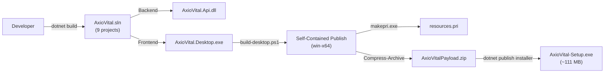

### Build Scripts

| Script                        | Purpose                                           |
|-------------------------------|---------------------------------------------------|
| `scripts/build-desktop.ps1`  | Full build pipeline: clean → build → generate PRI → publish → copy assets → create installer |
| `tools/dev-setup.ps1`        | Developer environment setup                       |
| `run-desktop.bat`            | Quick-launch desktop app                          |
| `run-desktop.ps1`            | Quick-launch desktop app (PowerShell)             |
| `AxioVital.bat`              | Launcher script                                   |

### CI/CD

| Workflow                          | Trigger                        | Steps                              |
|-----------------------------------|--------------------------------|------------------------------------|
| `ci-cd.yml`                       | Push/PR to `main`, `develop`   | Checkout → .NET 9 SDK → Restore → Build → Run Unit Tests |
| `build-desktop-exe.yml`          | (not inspected in detail)      | Desktop build pipeline             |

**Platform:** GitHub Actions on `windows-latest`

### Installer

The `axiovital-installer/` directory contains a C# console application (`AxioVitalSetup.csproj`) that produces `AxioVital-Setup.exe` — a self-extracting installer that bundles the published Desktop application.

---

## 31. Testing Architecture

| Test Project                    | Framework | Test Count | Scope                        |
|---------------------------------|-----------|------------|------------------------------|
| `AxioVital.UnitTests`          | xunit     | Minimal    | Unit test runner (`Program.cs` — 3.3 KB) |
| `AxioVital.IntegrationTests`   | xunit     | 1 file     | EF Core `DbContextTests` (1 KB) |
| `AxioVital.ApiTests`           | xunit     | 1 file     | `HealthEndpointTests` (1 KB)  |

**Testing tools declared in `Directory.Packages.props`:** xunit, FluentAssertions, NSubstitute, Moq, coverlet.collector, `Microsoft.AspNetCore.Mvc.Testing`, `Microsoft.EntityFrameworkCore.InMemory`.

**Observation:** Testing infrastructure is set up but test coverage is minimal. Most clinical views (30+) have no automated tests.

---

## 32. Error Handling & Observability

### Error Handling

| Layer          | Mechanism                                              | Scope                     |
|----------------|--------------------------------------------------------|---------------------------|
| **API**        | `GlobalExceptionMiddleware` → standardized `ApiErrorResponse` JSON | All API requests |
| **API**        | `CorrelationIdMiddleware` → `X-Correlation-Id` header  | Request tracing           |
| **API**        | Controller-level `try/catch` for `KeyNotFoundException` | Document endpoints       |
| **Desktop**    | `App.UnhandledException` → native Win32 MessageBox     | XAML exceptions           |
| **Desktop**    | `AppDomain.UnhandledException` → Serilog + MessageBox  | CLR exceptions            |
| **Desktop**    | `TaskScheduler.UnobservedTaskException` → Serilog      | Unobserved async errors   |
| **Desktop**    | `ApiClient` returns `default` on HTTP error             | Silent failure            |

### Logging

| Component      | Sink              | Format                                    | Retention    |
|----------------|-------------------|-------------------------------------------|--------------|
| API            | Console           | `[HH:mm:ss LVL] SourceContext | Message`  | —            |
| API            | File (rolling)    | `logs/axiovital-.log`                      | 30 days      |
| Desktop        | File (rolling)    | `logs/axiovital-desktop-.log`              | 14 days      |

### Observability Gaps

- No external crash reporting (Sentry, App Center, etc.)
- No metrics/APM (Application Insights, Prometheus, etc.)
- No distributed tracing (OpenTelemetry, Jaeger, etc.)
- No health check dashboard
- Desktop `ApiClient` silently returns `default` on failure — errors are not surfaced to UI

---

## 33. Current Architecture Status

| Component                  | Status                     | Evidence                                                 |
|----------------------------|----------------------------|----------------------------------------------------------|
| Desktop Application        | **Implemented**            | WinUI 3 app with 30+ views, builds and runs              |
| Backend REST API           | **Implemented**            | ASP.NET Core 9, 2 controllers, middleware pipeline       |
| UI Layer                   | **Implemented**            | Extensive XAML views (~1 MB total XAML)                   |
| Navigation                 | **Implemented**            | Frame-based + tab + overlay panels + keyboard hooks      |
| State Management           | **Partially Implemented**  | MVVM ViewModels but most state is code-behind; no persistence |
| API Layer (Desktop→API)    | **Partially Implemented**  | `ApiClient` exists but only auth endpoint is called (and it's simulated) |
| Document Management        | **Implemented**            | Full CRUD via API + MinIO + PostgreSQL                   |
| Authentication (Backend)   | **Partially Implemented**  | JWT + Argon2 infrastructure exists; no login endpoint    |
| Authentication (Desktop)   | **Partially Implemented**  | Login UI exists; auth is simulated with `Task.Delay`     |
| Multi-Tenancy              | **Implemented**            | EF Core global query filters + tenant resolution middleware |
| RBAC                       | **Partially Implemented**  | Domain entities (Role, Permission, UserRole) exist; no enforcement |
| Axio ID                    | **Not Identified**         | No references in code                                    |
| Axio Card                  | **Not Identified**         | No references in code                                    |
| ABHA Integration           | **Not Identified**         | No references in code                                    |
| Patient Identity           | **Partially Implemented**  | `PatientModel` (Desktop), `PatientId` on documents; no Patient entity in backend |
| Healthcare Data            | **Partially Implemented**  | Document management implemented; clinical data is UI-only mock |
| NFC                        | **Not Identified**         | No NFC code or dependencies                              |
| Biometrics                 | **Not Identified**         | No biometric code or dependencies                        |
| QR                         | **Not Identified**         | No QR code or dependencies                               |
| Local Storage              | **Not Implemented**        | No local DB or secure storage in Desktop                 |
| FHIR R4                    | **Referenced / Planned**   | Interface + config only                                  |
| HL7 v2.x                   | **Referenced / Planned**   | Interface + config only                                  |
| DICOM                      | **Referenced / Planned**   | Interface + config only                                  |
| Kafka/Messaging            | **Partially Implemented**  | Stub (log-only publisher/consumer)                       |
| Redis Caching              | **Implemented**            | `RedisCacheService` with full CRUD                       |
| Notifications              | **Not Implemented**        | UI view exists; no backend                               |
| Offline Sync               | **Not Implemented**        | No local persistence or sync                             |
| Security                   | **Partially Implemented**  | Argon2, JWT infra, tenant isolation; missing auth endpoints, authorization enforcement |
| Testing                    | **Partially Implemented**  | 3 test projects with minimal tests                       |
| CI/CD                      | **Implemented**            | GitHub Actions: build + test on Windows                  |
| Infrastructure (Docker)    | **Implemented**            | Docker Compose for PostgreSQL, Redis, Redpanda, MinIO    |
| Infrastructure (K8s/Terraform) | **Referenced / Planned** | Minimal placeholder files                               |
| Installer                  | **Implemented**            | Self-extracting `.exe` via `build-desktop.ps1`           |

---

## 34. Implemented vs Referenced Architecture

### Implemented

Features with sufficient code/configuration to function:

- WinUI 3 Desktop application with 30+ clinical views
- ASP.NET Core 9 REST API with clean architecture
- Medical document management (upload, download, list, search, delete, preview)
- MinIO object storage integration
- PostgreSQL 16 via EF Core 9 with migrations
- Redis 7 caching
- Multi-tenant data isolation (global query filters)
- JWT token generation and validation
- Argon2id password hashing
- Structured logging (Serilog → file + console)
- Global exception handling (API + Desktop)
- Docker Compose infrastructure
- GitHub Actions CI/CD
- Self-contained installer

### Partially Implemented

Features with meaningful but incomplete implementation:

- **Authentication flow** — JWT/Argon2 infrastructure exists but no login/register endpoints; Desktop login is simulated
- **RBAC** — Domain entities exist (Role, Permission, UserRole, RolePermission) but no enforcement middleware/handlers
- **Kafka messaging** — Docker Compose runs Redpanda; code has stub publisher/consumer that only log
- **CQRS pattern** — `Commands/` and `Queries/` folders exist with single stub files; not wired to MediatR or handlers
- **API authorization** — `PermissionRequirement` and `ApiKeyAuthenticationHandler` stubs exist; not wired up

### Referenced / Planned

Features appearing in interfaces, config, or documentation but without working implementation:

- **FHIR R4** — `IFhirService` interface + `FhirSettings` in `appsettings.json`
- **HL7 v2.x** — `IHl7Service` interface + `Hl7` section in `appsettings.json`
- **DICOM** — `IDicomService` interface + `Dicom` section in `appsettings.json`
- **WebAuthn/FIDO2** — `IWebAuthnService` interface (not registered in DI)
- **Kubernetes** — `deployment.yaml` placeholder (576 bytes)
- **Terraform** — `main.tf` placeholder (238 bytes)
- **Nginx** — `nginx.conf` placeholder (470 bytes)
- **API versioning** — `Asp.Versioning.*` packages in `Directory.Packages.props` but not used in code
- **Code analysis** — `Microsoft.CodeAnalysis.NetAnalyzers` package referenced but not enforced

### Not Identified

No reliable evidence found:

- Axio ID
- Axio Card
- ABHA / ABDM integration
- NFC functionality
- QR / barcode functionality
- Biometric / PIN authentication
- OAuth / social login
- Firebase / Supabase
- Analytics / crash reporting
- Push notifications
- Offline mode / data sync
- Data encryption at rest (beyond infrastructure defaults)

---

## 35. Known Architectural Gaps

| Gap                                          | Evidence                                              |
|----------------------------------------------|-------------------------------------------------------|
| **No authentication endpoint**               | `AuthenticationService` calls `api/v1/auth/login` but no such controller/action exists |
| **Simulated login**                          | `LoginPageViewModel` uses `Task.Delay(600)` instead of real authentication |
| **No authorization on API endpoints**        | `DocumentsController` lacks `[Authorize]` attributes  |
| **Desktop state not persisted**              | All state is in-memory; lost on restart               |
| **Patient entity missing in backend**        | `PatientModel` exists in Desktop only; `PatientId` on `MedicalDocument` has no FK target |
| **Clinical data is UI-only mock**            | 30+ clinical views contain hardcoded/mock data with no API integration |
| **Kafka messaging is a no-op**               | `KafkaEventPublisher.PublishAsync()` calls `await Task.CompletedTask` |
| **CQRS not wired**                           | `CreateUserCommand` and `GetUserByIdQuery` exist but have no handlers or MediatR |
| **Duplicate mocking frameworks**             | Both `NSubstitute` and `Moq` are declared as dependencies |
| **RBAC entities exist but are unenforced**   | `Role`, `Permission`, `UserRole`, `RolePermission` entities have no authorization middleware |
| **Interop interfaces have no implementations** | FHIR, HL7, DICOM interfaces exist in Infrastructure but have no concrete classes |
| **Secrets committed to repository**          | `.env` contains actual passwords and keys             |
| **Minimal test coverage**                    | 3 test files across 3 test projects for a 30+ view application |

---

## 36. Architectural Risks

| Risk                                                | Severity     | Classification |
|------------------------------------------------------|-------------|----------------|
| Credentials in `.env` committed to source control    | **Critical** | Observed       |
| No authentication enforcement on API endpoints       | **Critical** | Observed       |
| Login bypassed with `Task.Delay` simulation          | **High**     | Observed       |
| JWT secret fallback hardcoded in `Program.cs`        | **High**     | Observed       |
| No authorization checks on document operations       | **High**     | Observed       |
| Client silently swallows HTTP errors (`return default`) | **Medium** | Observed       |
| `MainPage.xaml.cs` is 2,453 lines / 104 KB          | **Medium**   | Observed — high coupling, difficult to maintain |
| No local data persistence in Desktop                 | **Medium**   | Observed       |
| No automated tests for clinical views                | **Medium**   | Observed       |
| Kafka stubs may mask integration failures            | **Low**      | Observed       |
| Infrastructure manifests (K8s, Terraform) are stubs  | **Low**      | Observed       |

---

## 37. Architecture Decision Notes

| Decision                                   | Evidence                                     | Trade-off                                   |
|--------------------------------------------|----------------------------------------------|---------------------------------------------|
| **Clean Architecture layers**              | Domain → Application → Infrastructure → API  | Maintainability vs. complexity for current size |
| **WinUI 3 over WPF/Electron**              | `.csproj` targets `net9.0-windows10.0.19041.0` with `UseWinUI=true` | Modern Windows-native UI; limits to Windows |
| **Unpackaged deployment**                  | `WindowsPackageType=None`, custom installer  | Avoids MSIX/Store; requires manual SmartScreen handling |
| **Central package management**             | `Directory.Packages.props`                   | Version consistency; adds indirection       |
| **Multi-tenant via query filters**         | `AxioVitalDbContext.OnModelCreating()`       | Simple, EF-native; limited to EF operations |
| **Argon2id over BCrypt/PBKDF2**            | `Argon2PasswordHasher` with 64 MB memory     | Stronger security; higher resource usage    |
| **Redpanda over Apache Kafka**             | Docker Compose uses `redpanda:v24.1.1`       | Lighter weight dev; Kafka-compatible API    |
| **MinIO over cloud S3**                    | Docker Compose, S3-compatible API            | Self-hosted; avoids cloud dependency        |
| **Serilog over built-in logging**          | Both API and Desktop use Serilog             | Rich structured logging; additional dependency |
| **Shared Contracts project**               | Desktop references `AxioVital.Contracts`     | Type-safe API contracts; tight coupling between frontend and backend |

---

## 38. Complete Communication Map

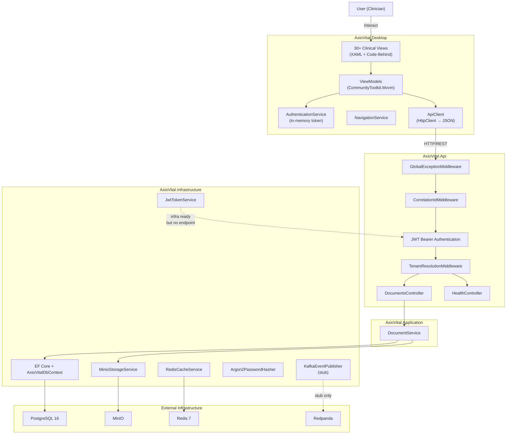

---

## 39. Complete Data Flow Map

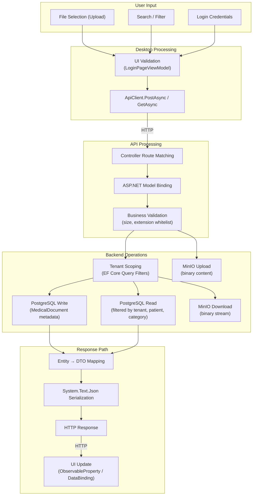

---

## 40. Source-of-Truth References

| Component                 | Primary Source Files                                            |
|---------------------------|------------------------------------------------------------------|
| **Solution Structure**    | [`AxioVital.sln`](file:///c:/Users/HP/native/AxioVital.sln)    |
| **API Entry Point**       | [`Program.cs`](file:///c:/Users/HP/native/axiovital-backend/AxioVital.Api/Program.cs) |
| **Desktop Entry Point**   | [`App.xaml.cs`](file:///c:/Users/HP/native/axiovital-frontend/AxioVital.Desktop/App.xaml.cs) |
| **Desktop Main UI**       | [`MainPage.xaml.cs`](file:///c:/Users/HP/native/axiovital-frontend/AxioVital.Desktop/Views/MainPage.xaml.cs) |
| **Window Host**           | [`MainWindow.xaml.cs`](file:///c:/Users/HP/native/axiovital-frontend/AxioVital.Desktop/MainWindow.xaml.cs) |
| **Document API**          | [`DocumentsController.cs`](file:///c:/Users/HP/native/axiovital-backend/AxioVital.Api/Controllers/DocumentsController.cs) |
| **Document Service**      | [`DocumentService.cs`](file:///c:/Users/HP/native/axiovital-backend/AxioVital.Application/Services/DocumentService.cs) |
| **Domain Entities**       | [`axiovital-backend/AxioVital.Domain/Entities/`](file:///c:/Users/HP/native/axiovital-backend/AxioVital.Domain/Entities) |
| **DbContext**             | [`AxioVitalDbContext.cs`](file:///c:/Users/HP/native/axiovital-backend/AxioVital.Infrastructure/Persistence/AxioVitalDbContext.cs) |
| **JWT Service**           | [`JwtTokenService.cs`](file:///c:/Users/HP/native/axiovital-backend/AxioVital.Infrastructure/Authentication/JwtTokenService.cs) |
| **Password Hasher**       | [`Argon2PasswordHasher.cs`](file:///c:/Users/HP/native/axiovital-backend/AxioVital.Infrastructure/Authentication/Argon2PasswordHasher.cs) |
| **MinIO Storage**         | [`MinioStorageService.cs`](file:///c:/Users/HP/native/axiovital-backend/AxioVital.Infrastructure/Storage/MinioStorageService.cs) |
| **Redis Cache**           | [`RedisCacheService.cs`](file:///c:/Users/HP/native/axiovital-backend/AxioVital.Infrastructure/Caching/RedisCacheService.cs) |
| **Kafka Stub**            | [`KafkaMessaging.cs`](file:///c:/Users/HP/native/axiovital-backend/AxioVital.Infrastructure/Messaging/KafkaMessaging.cs) |
| **Infra DI**              | [`DependencyInjection.cs`](file:///c:/Users/HP/native/axiovital-backend/AxioVital.Infrastructure/DependencyInjection.cs) |
| **App DI**                | [`DependencyInjection.cs`](file:///c:/Users/HP/native/axiovital-backend/AxioVital.Application/DependencyInjection.cs) |
| **Desktop API Client**    | [`ApiClient.cs`](file:///c:/Users/HP/native/axiovital-frontend/AxioVital.Desktop/Services/ApiClient.cs) |
| **Desktop Auth**          | [`AuthenticationService.cs`](file:///c:/Users/HP/native/axiovital-frontend/AxioVital.Desktop/Services/AuthenticationService.cs) |
| **Login ViewModel**       | [`LoginPageViewModel.cs`](file:///c:/Users/HP/native/axiovital-frontend/AxioVital.Desktop/ViewModels/LoginPageViewModel.cs) |
| **Shared Contracts**      | [`axiovital-backend/AxioVital.Contracts/`](file:///c:/Users/HP/native/axiovital-backend/AxioVital.Contracts) |
| **Docker Infrastructure** | [`docker-compose.yml`](file:///c:/Users/HP/native/docker-compose.yml) |
| **Build Script**          | [`scripts/build-desktop.ps1`](file:///c:/Users/HP/native/scripts/build-desktop.ps1) |
| **CI/CD**                 | [`.github/workflows/ci-cd.yml`](file:///c:/Users/HP/native/.github/workflows/ci-cd.yml) |
| **SQL Migration**         | [`database/migrations/001_InitialCreate.sql`](file:///c:/Users/HP/native/database/migrations/001_InitialCreate.sql) |
| **Package Versions**      | [`Directory.Packages.props`](file:///c:/Users/HP/native/Directory.Packages.props) |
| **Environment Config**    | [`.env.example`](file:///c:/Users/HP/native/.env.example) |
| **API Config**             | [`appsettings.json`](file:///c:/Users/HP/native/axiovital-backend/AxioVital.Api/appsettings.json) |
